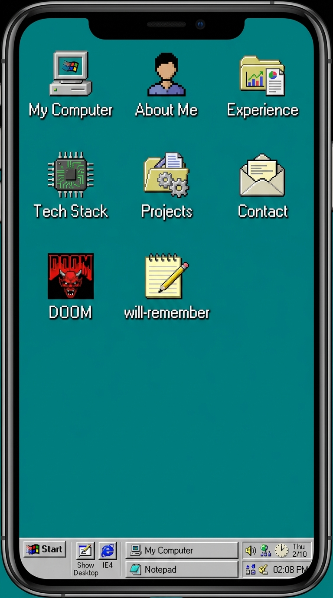
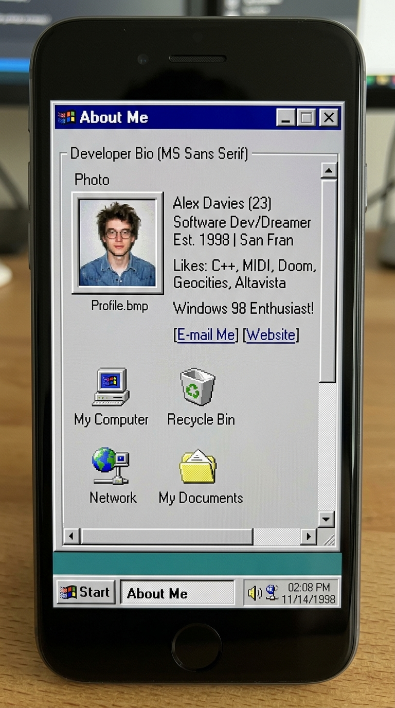

# 📋 PRD & Wireframe — Mobile Responsive Windows 98 OS Shell (`ufeek OS`)

> **Document Type**: Product Requirement Document (PRD) & UI/UX Wireframe Specification  
> **Target Project**: `ufeek OS` (Personal Portfolio Desktop OS)  
> **Author**: Antigravity Assistant & Fikri Sidqi (Ufeek)  
> **Path**: `docs/PRD-mobile-responsive-os.md`  
> **Status**: Draft Proposal & Ready for Review  

---

## 1. Problem Statement & Context

Saat ini, **ufeek OS** didesain sebagai desktop operating system Windows 98 klasik yang bekerja sangat imersif pada resolusi desktop / laptop (layar lebar > 1024px). Namun, ketika dibuka pada perangkat **mobile** (smartphone portrait 360px – 534px seperti pada tangkapan layar DevTools):

```
┌──────────────────────────────────────────────────────────┐
│ MASALAH TAMPILAN MOBILE SAAT INI (EXISTING PAIN POINTS)  │
├──────────────────────────────────────────────────────────┤
│ 1. Window Off-Screen / Terpotong:                        │
│    - Window diposisikan dengan koordinat absolut         │
│      (misal: x: 200, y: 150), sehingga di layar 390px    │
│      jendela terlempar ke kanan dan terpotong.           │
│                                                          │
│ 2. Desktop Icons Tumpang Tindih (Clutter):               │
│    - Deretan ikon desktop di sebelah kiri (x: 20)        │
│      tertutup sebagian oleh jendela yang terbuka,        │
│      menghasilkan visual "slice" yang aneh.              │
│                                                          │
│ 3. Target Sentuh Terlalu Kecil (Finger-Unfriendly):      │
│    - Tombol kontrol window ([_], [口], [X]) hanya 22x22px│
│      sehingga sulit ditekan jari tanpa salah klik.       │
│                                                          │
│ 4. Mekanisme Double-Click pada Touchscreen:              │
│    - Membuka aplikasi desktop membutuhkan double-click   │
│      (< 400ms) yang tidak alami bagi pengguna HP.        │
│                                                          │
│ 5. Konflik Drag & Scroll:                                │
│    - Fitur drag title bar mengganggu scrolling konten    │
│      internal jendela di perangkat sentuh.               │
└──────────────────────────────────────────────────────────┘
```

---

## 2. Core Vision: "Windows CE / Pocket PC Meets Windows 98 Desktop"

Tujuan utama dari penyesuaian mobile ini adalah:
1. **Thematic Purity**: Tetap 100% berakar pada estetika retro nostalgia Windows 98 / Windows CE / Pocket PC (warna teal `#008080`, beveled 3D borders, font Tahoma/MS Sans Serif, pixel-art icons). **Tidak ada modern UI slop** (tidak ada soft blur modern, border-radius bulat, atau glassmorphism).
2. **Auto-Maximized App Shell on Mobile**: Di layar `< 768px`, jendela yang dibuka langsung beradaptasi menjadi **Full-Screen Sheet** rapi yang memanfaatkan 100% viewport tanpa keluar batas layar.
3. **Touch-First Ergonomics**:
   - Single tap untuk membuka ikon aplikasi di mobile.
   - Hit target tombol minimal 36px – 44px untuk kenyamanan jempol.
   - Bottom Taskbar tetap menjadi dock navigasi utama untuk switch antar aplikasi dan memunculkan Start Menu.

---

## 3. Wireframes (ASCII Architecture)

### 3.1 Wireframe: Mobile Desktop (Home Screen Grid)
*Kondisi ketika tidak ada window yang terbuka atau semua window diminimize.*



```text
┌─────────────────────────────────────────────────┐ ◄─── 100vw (e.g. 390px)
│                                  ufeek OS [98]  │
│  [Teal Background #008080 + Cyber Glitch Grid]  │
│                                                 │
│   ┌────────┐     ┌────────┐     ┌────────┐      │
│   │ 🖥️      │     │ 👤     │     │ 💼     │      │
│   │ My PC  │     │About Me│     │Experi..│      │
│   └────────┘     └────────┘     └────────┘      │
│                                                 │
│   ┌────────┐     ┌────────┐     ┌────────┐      │
│   │ 🛠️     │     │ 📁     │     │ ✉️     │      │
│   │TechStk │     │Projects│     │Contact │      │
│   └────────┘     └────────┘     └────────┘      │
│                                                 │
│   ┌────────┐     ┌────────┐                     │
│   │ 💀     │     │ 📝     │                     │
│   │DOOM.EXE│     │will-rem│                     │
│   └────────┘     └────────┘                     │
│                                                 │
│                                                 │
│                                                 │
├─────────────────────────────────────────────────┤ ◄─── Taskbar (Height 40px)
│ [🏁 Start]  [ 📄 Welcome... ]       [ 02:14 PM] │
└─────────────────────────────────────────────────┘
```

**Fitur Desktop Grid:**
- Ikon disusun rapi dalam grid 3 kolom (`grid-cols-3` atau flex wrap terpusat).
- Ukuran ikon: 36x36px dengan label teks berkontur hitam (`text-shadow: 1px 1px 0 #000`).
- **Single tap** langsung membuka window bersangkutan dengan audio klik retro.

---

### 3.2 Wireframe: Mobile Active Window (Full-Screen Auto-Maximized)
*Kondisi saat sebuah window (misal: "About Me" atau "Experience") sedang aktif.*



```text
┌─────────────────────────────────────────────────┐
│ 🟦 About Me                             [_] [X] │ ◄─── Title Bar (Height: 34px)
├─────────────────────────────────────────────────┤
│┌───────────────────────────────────────────────┐│ ◄─── Sunken Window Surface
││ ┌────────┐  MUHAMMAD FIKRI SIDQI              ││
││ │ 👨‍💻 Photo│  Frontend Engineer                ││
││ └────────┘  Jakarta, Indonesia                ││
││ ───────────────────────────────────────────── ││
││ "My name is Fikri. I go by the moniker        ││
││  Ufeek — a play on words for 'You' & 'Fik'..."││
││                                               ││
││ As a dedicated Frontend Engineer, I channel   ││
││ this mindset into crafting intuitive and      ││
││ high-performance web applications...          ││
││                                               ││
││ [■] 5+ Years Experience (React, Next.js, TS)  ││
││ [■] Enterprise Clients: Manulife, Zurich, BPN ││
││                                               ││
││                  ┌──────────┐                 ││
││                  │ [ OK ]   │                 ││
││                  └──────────┘                 ││
│└───────────────────────────────────────────────┘│
├─────────────────────────────────────────────────┤
│ [🏁 Start]  [ 👤 About Me  ▼]       [ 02:14 PM] │ ◄─── Bottom Taskbar Dock
└─────────────────────────────────────────────────┘
```

**Fitur Window Mobile:**
- **Posisi**: `top: 0, left: 0, width: 100vw, height: calc(100dvh - 40px)` (memperhitungkan dynamic viewport address bar HP).
- **Title Bar**:
  - Tinggi 34px, warna biru aktif Win98 (`bg-win98-title-active`).
  - Tombol `[_]` (Minimize): Mengembalikan user ke layar Desktop Home.
  - Tombol `[X]` (Close): Menutup aplikasi.
  - Tombol Maximize di-hidden di mobile karena sudah 100% full screen.
- **Scroll**: Konten internal dapat di-scroll secara independen menggunakan native touch momentum scroll (`-webkit-overflow-scrolling: touch`), tanpa ada scrollbar ganda di level `body`.

---

### 3.3 Wireframe: Mobile Start Menu (Bottom Drawer Pop-Up)
*Kondisi saat tombol [Start] ditekan pada mobile.*

```text
┌─────────────────────────────────────────────────┐
│ (Backdrop Tap to Dismiss)                       │
│                                                 │
│                                                 │
│ ┌───────────────────────────┐                   │
│ │ 🟦 Ufeek 98               │                   │
│ ├───────────────────────────┤                   │
│ │ 🌐 GitHub Profile       > │ ◄─── Hit target: 42px
│ │ 💼 LinkedIn Profile     > │                   │
│ │ 📄 Download CV (PDF)    > │                   │
│ ├───────────────────────────┤                   │
│ │ 📝 will-remember Notes  > │                   │
│ │ 💼 Professional Exp     > │                   │
│ │ 📁 Featured Projects    > │                   │
│ │ ✉️ Contact Developer    > │                   │
│ └───────────────────────────┘                   │
├─────────────────────────────────────────────────┤
│ [🏁 Start (Active)]                 [ 02:14 PM] │
└─────────────────────────────────────────────────┘
```

---

## 4. Spesifikasi Perilaku & Interaksi Teknis

### 4.1 Deteksi Resolusi Mobile & Runes State
Dalam `osState.svelte.ts`:
```typescript
// Reaktif mendeteksi ukuran layar
let isMobile = $state(false);

function checkScreenSize() {
  if (typeof window !== 'undefined') {
    isMobile = window.innerWidth < 768;
  }
}
```

### 4.2 Aturan Perilaku Window (`Window.svelte`)
| Fitur | Mode Desktop (`>= 768px`) | Mode Mobile (`< 768px`) |
|---|---|---|
| **Lebar & Tinggi** | Sesuai konfigurasi (misal: 660x560px) | `width: 100vw; height: calc(100dvh - 40px);` |
| **Posisi** | Draggable (x, y berdasar posisi mouse) | Fixed `top: 0; left: 0;` (Drag dinonaktifkan) |
| **Borders** | `win98-border-outset` (3px) | `win98-border-outset` (2px) |
| **Tombol Kontrol** | `[_]`, `[口]`, `[X]` (22px) | `[_]` Minimize & `[X]` Close (32x32px hit target) |
| **Max-Width / Max-Height** | `90vw`, `85vh` | `100vw`, `calc(100dvh - 40px)` |

### 4.3 Aturan Ikon Desktop (`DesktopIcon.svelte`)
- **Desktop**: Menggunakan posisi absolut (`top: {y}px; left: {x}px;`) dan event double-click.
- **Mobile**:
  - Mengabaikan koordinat absolut `x/y`.
  - Mengalir (*flow*) dalam CSS Grid: `grid grid-cols-3 gap-4 p-4 place-items-center`.
  - **Single tap** langsung membuka window yang bersangkutan.

### 4.4 iOS & Android Mobile Quirks Handling
1. **Dynamic Viewport Height (`100dvh`)**:
   - Menggunakan `100dvh` agar tidak tertutup oleh URL bar Safari / Chrome mobile saat muncul atau sembunyi.
2. **Input Font Zoom Prevention**:
   - Semua elemen input dan textarea di mobile memiliki `font-size: 16px` minimal (atau `text-base` di media query mobile) untuk mencegah Safari iOS auto-zoom saat fokus.
3. **Overscroll Behavior**:
   - `overscroll-behavior: none;` pada root desktop untuk mencegah *pull-to-refresh* atau *elastic rubber-banding* browser yang merusak ilusi OS desktop.

---

## 5. Matriks Adaptasi Tiap Komponen Aplikasi

| Komponen | Adaptasi Mobile yang Dilakukan |
|---|---|
| **Hero / Welcome** | Foto profil & teks nama vertikal-terpusat, tombol "View Work" & "Contact" full-width / stacked. |
| **About Me** | Foto profil di baris atas, paragraf bio berukuran 13px yang mudah dibaca dengan margin nyaman. |
| **Experience** | Header per-pekerjaan (Nama PT, Tanggal, Lokasi) membungkus rapi secara vertikal (`flex-col`), chip dependencies wrap horizontal. |
| **Projects** | Grid executable `.exe` 3 kolom, saat project diklik preview gambar menyesuaikan `max-w-full`. |
| **Tech Stack** | Grid ikon 3 kolom di tab Icons, tabel responsif dengan scroll horizontal di tab Details. |
| **will-remember** | Tombol toolbar `Explorer` untuk buka/tutup sidebar tree catatan (drawer mode), tab bar horizontal touch scroll. |
| **Doom.exe** | Layar canvas menyesuaikan aspect ratio 4:3 dengan overlay petunjuk keyboard / kontrol sentuh. |

---

## 6. Rencana Implementasi Bertahap (Roadmap)

- [ ] **Fase 1: Layout & State Engine**
  - Tambahkan reactive detector `isMobile` pada `osState.svelte.ts` (menggunakan listener `resize` & runes Svelte 5).
  - Integrasikan auto-maximized logic pada `Window.svelte` khusus untuk layar mobile.
- [ ] **Fase 2: Mobile Desktop & Grid**
  - Ubah wrapper desktop icon di `+page.svelte` agar menerapkan `grid grid-cols-3 gap-4` saat `isMobile === true`.
  - Perbarui `DesktopIcon.svelte` agar mendukung **single-tap** instan pada mobile.
- [ ] **Fase 3: Touch-Optimized Taskbar & Start Menu**
  - Sesuaikan padding dan lebar tombol Start dan taskbar buttons untuk kenyamanan sentuhan jari.
  - Perbesar area klik `StartMenu.svelte` menjadi 40px+ per baris menu.
- [ ] **Fase 4: Testing & Polish di Real Mobile Viewports**
  - Uji di viewport iPhone SE (375px), iPhone 14/15 (393px), dan Android standar (412px).
  - Pastikan tidak ada horizontal scrollbar liar pada desktop body.

---

> Dokumen ini siap dijadikan acuan desain dan implementasi saat kamu menghendaki penyesuaian mobile diterapkan! 🚀
