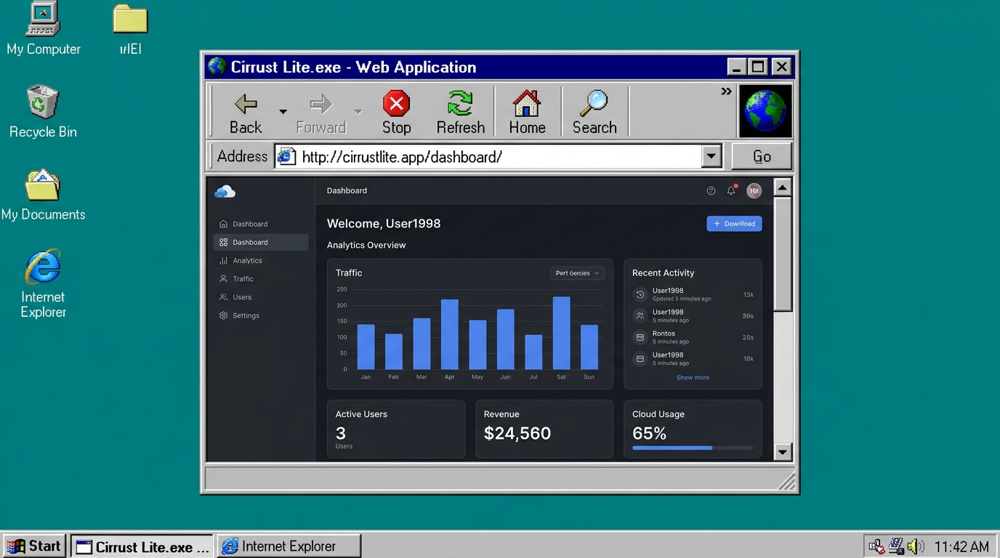

# PRD: ufeek OS — Project Executable (.exe) Runner & App Sandbox

> **Document Version:** 1.0.0  
> **Status:** Draft / Conceptual Review  
> **Author:** Antigravity x Fikri Sidqi (Ufeek)  
> **Target Platform:** ufeek OS (`ufeek.is-a.dev`) — Svelte 5 / SvelteKit / Tailwind CSS 3  

---

## 1. Executive Summary & Vision

Saat ini, portofolio **ufeek OS** menyajikan daftar proyek di dalam folder `C:\Projects\` dalam format daftar `.exe` statis. Ketika pengguna mengklik salah satu item, sistem hanya menampilkan detail teks, dependensi `.dll`, dan tangkapan layar (screenshot).

**Visi Fitur Baru:**  
Mengubah konsep portofolio konvensional menjadi **True Interactive OS Experience**. Setiap proyek portofolio diperlakukan sebagai file eksekusi riil (`.exe`) yang dapat **dijalankan langsung (run)** di dalam jendela Windows 98. Pengunjung tidak hanya *membaca* apa yang telah dibuat oleh Ufeek, tetapi dapat langsung **berinteraksi, mencoba, dan merasakan pengalaman aplikasinya** tanpa pernah meninggalkan lingkungan desktop retro ufeek OS.



---

## 2. Problem Statement & Challenges

1. **Keberagaman Tipe Proyek:**
   - **Proyek Publik/Live Web:** Memiliki URL live yang bisa diakses publik (contoh: tools personal, web portofolio, demo games).
   - **Proyek Enterprise/Klien Rahasia:** Proyek seperti *Zurich CMS*, *Mirecruit (Manulife)*, atau *E-Kantah BPN* berada di balik VPN/auth perusahaan, menggunakan database privat, atau memiliki kebijakan kerahasiaan (NDA).
2. **Keterbatasan Teknis Web Iframe:**
   - Banyak website modern mengaktifkan header `X-Frame-Options: DENY` atau `Content-Security-Policy: frame-ancestors 'none'`, yang memblokir rendering di dalam `<iframe>`.
3. **Imersi & Nostalgia Windows 98:**
   - Peluncuran aplikasi harus terasa otentik: ada cursor jam pasir (`wait.cur`), dialog splash screen/loading progress bar, taskbar entry baru, serta jendela aplikasi yang responsif.

---

## 3. Core Architecture: Multi-Mode Project Execution

Untuk mengakomodasi semua tipe proyek (baik publik maupun enterprise), dirancang arsitektur **3-Tier Execution Engine**:

```
                              [ Double Click Project.exe ]
                                           │
                                           ▼
                            [ Retro Launcher / Splash ]
                           "Launching application..."
                                           │
                      ┌────────────────────┼────────────────────┐
                      ▼                                         ▼
            [ Mode A: Live Runner ]                  [ Mode B: Interactive Sandbox ]
           (Untuk Public / Demo Apps)              (Untuk Enterprise / Client Apps)
                      │                                         │
        ┌─────────────┴─────────────┐                           │
        ▼                           ▼                           │
[ Embedded Iframe ]     [ In-OS Internet Explorer ]             │
- Direct app view       - Win98 Browser Chrome                  │
- Viewport switcher     - Address bar, refresh, etc.            │
        │                                                       │
        ▼ (Jika X-Frame blocked)                                │
[ Win98 Security Dialog ]                                       │
"External Launch required"                                      │
        │                                                       │
        └───────────────────────────┬───────────────────────────┘
                                    ▼
                      [ In-Window App Companion ]
                      ├── 🎮 Live Runtime / Simulation
                      ├── 📋 Tech Specs & Architecture (.NFO)
                      ├── 📸 Screenshots Gallery
                      └── 🔗 Source Code / Case Study
```

### Mode A: Live App Runner (Embedded Runtime)
- **Target:** Proyek yang memiliki deployment live publik atau micro-frontend demo.
- **Mekanisme:**
  - Aplikasi dimuat di dalam jendela Windows 98 menggunakan container `<iframe>` yang di-sandbox secara aman (`sandbox="allow-scripts allow-same-origin allow-forms"`).
  - Terdapat tombol kontrol retro di atas jendela: **Reload**, **Open in New Tab**, dan **Resolution Toggle** (Desktop 1024x768 / Mobile 375x667).

### Mode B: Interactive Mock Sandbox (Simulasi Interaktif)
- **Target:** Proyek enterprise (Zurich, Manulife Mirecruit, BPN) yang tidak memiliki server publik.
- **Mekanisme:**
  - Membuka replika interaktif ringan dari halaman utama/dashboard aplikasi tersebut langsung di dalam Svelte (mock login screen, mini interactive table, chart interaktif, atau form simulator).
  - Memberikan pengunjung *feel* menggunakan aplikasi aslinya secara instan tanpa perlu akun/kredensial rill.

### Mode C: In-OS "Internet Explorer 5.0"
- Menyediakan aplikasi browser terdedikasi di desktop: **Internet Explorer**.
- Pengunjung bisa membuka website apa pun atau memilih dari menu dropdown *Favorites* / *History* yang berisi daftar proyek Ufeek.

---

## 4. User Journey & Interaction Flow

1. **Discovery:**
   - Pengunjung menemukan shortcut `[Project].exe` di **Desktop**, di dalam folder **C:\Projects\\**, atau melalui **Start Menu > Programs > Portfolio Projects**.
2. **Execution Trigger:**
   - Double-click (di desktop) atau single-tap (di mobile) pada ikon `.exe`.
3. **Launch Feedback (Micro-interaction):**
   - Cursor desktop sesaat berubah menjadi jam pasir retro (`wait.cur`).
   - Muncul dialog modal kecil selama 400ms:
     ```text
     +-------------------------------------------------------+
     | Starting Program...                                   |
     +-------------------------------------------------------+
     | Initializing Zurich_CMS.exe                           |
     | Loading libraries: React, TypeScript, .NET Core       |
     | [████████████████████░░░░░░] 78%                      |
     +-------------------------------------------------------+
     ```
4. **Window Mount & Taskbar State:**
   - Jendela baru terbuka dengan title bar aktif: `[Icon] Zurich CMS - Version 2.4.exe`.
   - Tombol aktif muncul di Taskbar bawah sehingga pengguna bisa meminimalisir, memaksimalkan, atau menjalankan 2-3 project sekaligus!
5. **In-App Navigation:**
   - Pengguna dapat beralih antara tab:
     - `[▶ Run / Live Demo]`
     - `[ℹ System Specs (.NFO)]`
     - `[🖼 Gallery (.BMP)]`
     - `[↗ External Link]`

---

## 5. UI/UX Design Specifications (The Windows 98 "Wah" Factor)

### 5.1 Window Structure
Setiap jendela aplikasi yang berjalan mengikuti anatomi Windows 98 murni:
- **Title Bar:** Gradient biru gelap (`#000080` ke `#1084d0`) dengan icon unik proyek, tombol minimize, maximize, dan close (`X`).
- **Menu Bar:** `File`, `View`, `Options`, `Help` (dengan fungsionalitas retro seperti "About Application", "Copy Link", "Export Specs").
- **App Toolbar:**
  - Tombol retro 3D: `[ Back ]`, `[ Forward ]`, `[ Refresh ]`, `[ Fullscreen ]`, `[ Specs ]`.
- **Main Viewport:** Area sunken (`win98-border-inset`) berlatar belakang putih tempat iframe atau simulasi berjalan.
- **Status Bar:** Bagian bawah jendela bertuliskan:
  - Sisi kiri: `"Status: Connected (200 OK)"` atau `"App State: Ready"`.
  - Sisi kanan: `"Memory: 4,096 KB"` | `"Resolution: 1024x768"`.

### 5.2 X-Frame-Options Handling (Fallback Guard)
Jika sebuah proyek live memblokir iframe (misal domain pihak ketiga dengan proteksi ketat), sistem secara elegan menampilkan dialog error klasik Windows 98:
```text
+---------------------------------------------------------------+
| Security Alert - ufeek OS Sandbox                             |
+---------------------------------------------------------------+
| [X] The application 'Cirrust Lite' cannot be embedded due to  |
|     external domain security policies (X-Frame-Options).      |
|                                                               |
|     Would you like to execute this application in an          |
|     external browser window instead?                          |
|                                                               |
|          [ Open in Browser ]         [ Cancel ]               |
+---------------------------------------------------------------+
```

---

## 6. Data Schema & Architecture

Model proyek di `src/lib/data/projects.ts` diperkaya dengan metadata eksekusi:

```typescript
export interface ProjectExecutable {
  id: string;                    // e.g. "zurich-cms"
  title: string;                 // e.g. "Zurich CMS"
  exeName: string;               // e.g. "Zurich_CMS.exe"
  icon: string;                  // Custom pixel-art icon path
  description: string;           // Brief summary
  type: 'live' | 'sandbox' | 'docs'; // Execution mode
  liveUrl?: string;              // URL for iframe embed or direct launch
  technologies: string[];        // Dependencies (.dll list)
  client?: string;               // e.g. "Zurich Insurance Indonesia"
  role: string;                  // e.g. "Frontend Engineer"
  year: string;                  // e.g. "2023 - 2024"
  screenshots: string[];         // High-res captures
  specs: {
    features: string[];
    challenges: string;
    impact: string;
  };
  mockComponent?: string;        // Optional interactive Svelte component name
}
```

---

## 7. Responsiveness & Mobile Adaptability

- **Desktop (>= 768px):**
  - Jendela proyek berukuran ideal (misal 900x600px), bebas digeser (*draggable*) dan diubah ukurannya (*resizable*).
  - Multi-window multitasking didukung penuh.
- **Mobile (< 768px):**
  - Jendela otomatis dibuka dalam mode maximized (full screen).
  - Terdapat bar navigasi kompak retro di bagian atas dengan tombol `Back to Desktop` dan tab switcher.
  - Iframe diatur dengan scaling responsif agar tetap nyaman dilihat pada layar sentuh.

---

## 8. Implementation Roadmap

| Fase | Milestones & Deliverables | Estimasi Kompleksitas |
|---|---|:---:|
| **Fase 1** | **Data Model & Launcher Dialog:** Memperbarui data proyek dengan schema eksekusi, membuat komponen splash/progress bar Win98 saat `.exe` diklik. | Rendah |
| **Fase 2** | **App Runner Window Component:** Membuat template window `AppRunner.svelte` dengan toolbar browser, iframe container, fallback dialog, dan tab switcher. | Sedang |
| **Fase 3** | **Integrated Projects:** Menghubungkan proyek publik yang ada (misal live apps, tools) dan menyematkan interactive mock showcase untuk proyek enterprise (Zurich, Manulife, BPN). | Sedang |
| **Fase 4** | **Desktop Shortcuts & Start Menu:** Menambahkan shortcut `.exe` untuk proyek-proyek unggulan langsung ke Desktop Canvas dan submenu *Programs*. | Rendah |

---

## 9. Success Metrics
1. **Engagement Time:** Peningkatan durasi kunjungan pengunjung karena bisa mencoba langsung aplikasi di dalam portofolio.
2. **Authenticity:** Zero break dalam ilusi desktop Windows 98 — tidak ada redirect tiba-tiba yang membingungkan pengunjung.
3. **Client Appeal:** Memberikan impresi teknis yang kuat ("wah" factor) kepada recruiter dan tech lead yang mencoba portofolio.

---

## 10. Project Executable Registry & Sandbox Status

| Executable Name | Proyek | Mode | Status Implementasi | Catatan & Integrasi |
|---|---|---|:---:|---|
| `Cirrust_Lite.exe` | Cirrust Lite Customer Portal | Interactive Sandbox (`CirrustLiteMock.svelte`) | ✅ Production Ready | Form multi-state, validation, auto license .zip download |
| `Liriq_RFID.exe` | Liriq RFID Tracking System | Interactive Sandbox (`LiriqMock.svelte`) | ✅ Production Ready | Authentic AntD table, status pills, RFID telemetry, modals, CSV report export |
| `Kansai_Custom.exe` | Kansai Paint Manufacturing | Interactive Sandbox (`KansaiMock.svelte`) | ⚠️ Draft (Pending Polish) | Skipped sementara per feedback pengguna; pending penyesuaian akurasi form formula |
| `EKantah_BPN.exe` | E-Kantah ATR/BPN | Interactive Sandbox (`BpnMock.svelte`) | ⚠️ Draft (Pending Polish) | Skipped sementara per feedback pengguna; pending penyesuaian akurasi alur pendaftaran |
| `Cirrust_Workflow.exe`| Cirrust Approval Engine | System Specs (.NFO) | 📋 Specs Mode | Arsitektur & visual state inspector |
| `Impulse_Web.exe` | Impulse Executive BI | System Specs (.NFO) | 📋 Specs Mode | Executive KPI metrics |

